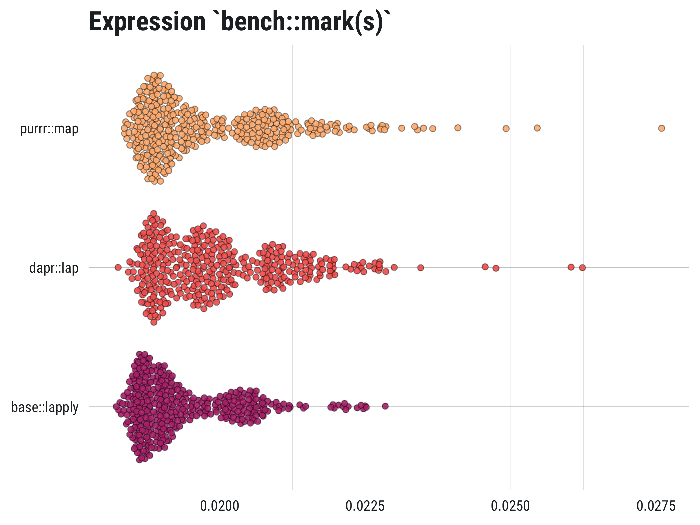

<!-- README.md is generated from README.Rmd. Please edit that file -->

# dapr 

[](https://travis-ci.org/mkearney/dapr)
[](https://cran.r-project.org/package=dapr)
[](https://codecov.io/gh/mkearney/dapr?branch=master)
[](https://doi.org/10.5281/zenodo.2528504)


[](https://www.tidyverse.org/lifecycle/#experimental)

Dependency-free purrr-like apply/map/iterate functions

## Installation

Install the development version from Github with:

``` r
## install remotes pkg if not already
if (!requireNamespace("remotes", quietly = TRUE)) {
  install.packages("remotes")
}

## install from github
remotes::install_github("mkearney/dapr")
```

## {dapr} vs. {base} & {purrr}?

**{dapr}** provides the ease and consistency of
[**{purrr}**](https://purrr.tidyverse.org), (see also: simple benchmark
results plot below) including use of `~` and `.x`, without all the
dependencies. In other words, use **{dapr}** when you want a purrr-like
experience but you need a lightweight solution.

<p align="center">



</p>

## Use

Function names use the convention `*ap()` where **`*`** is the first
letter of output data type.

  - <code><span style="font-weight:bold;text-decoration:underline">v</span>ap</code>
    for **vectors**
  - <code><span style="font-weight:bold;text-decoration:underline">l</span>ap</code>
    for **lists**
  - <code><span style="font-weight:bold;text-decoration:underline">d</span>ap</code>
    for **data frames**

Common inputs:

  - `.data` Input object–numeric, character, list, data frame, etc.–over
    which elements will be iterated. If matrix or data frame, each
    column will be treated as the elements which are to be iterated
    over.
  - `.f` Function to apply to each element of input object. This can be
    written as a single function name e.g., `mean`, a formula-like
    function call where `.x` is assumed to be the iterated over element
    of input data e.g., `~ mean(.x)`, or an in-line function definition
    e.g., `function(x) mean(x)`.

### Vectors

Functions that apply expressions to input data objects and return atomic
vectors e.g., numeric (double), character, logical.

  - **`vap_dbl()`** Iterate and return **numeric** vector.
  - **`vap_int()`** Iterate and return **integer** vector.
  - **`vap_lgl()`** Iterate and return **logical** vector.
  - **`vap_chr()`** Iterate and return **character** vector.

<!-- end list -->

``` r
## create data
set.seed(2018)
d <- replicate(5, rnorm(10), simplify = FALSE)
e <- replicate(5, sample(letters, 10), simplify = FALSE)

## numeric
vap_dbl(d, ~ mean(.x))
#> [1]  0.26934527 -0.55232322  0.05559290 -0.06253258 -0.11183760

## integer
vap_int(d, length)
#> [1] 10 10 10 10 10

## logical
vap_lgl(d, ~ max(.x) > 3)
#> [1] FALSE FALSE FALSE FALSE FALSE

## character
vap_chr(e, paste, collapse = "")
#> [1] "hizjpgcexk" "rbeovimtxh" "ujrimwgvzs" "euwrlytgbj" "qkrhylgmnx"
```

### Lists

Function(s) that apply expressions to input data objects and return
lists.

  - **`lap()`** Iterate and return a **list** vector.

<!-- end list -->

``` r
## list of strings
lap(e[1:2], ~ paste0(.x, "."))
#> [[1]]
#>  [1] "h." "i." "z." "j." "p." "g." "c." "e." "x." "k."
#> 
#> [[2]]
#>  [1] "r." "b." "e." "o." "v." "i." "m." "t." "x." "h."
```

  - **`ilap()`** Iterate over sequence length `.i` (instead of `.x`) and
    return a **list** vector.

<!-- end list -->

``` r
## list of strings
ilap(1:4, ~ paste0(letters[.i], rev(LETTERS)[.i]))
#> [[1]]
#> [1] "aZ"
#> 
#> [[2]]
#> [1] "bY"
#> 
#> [[3]]
#> [1] "cX"
#> 
#> [[4]]
#> [1] "dW"
```

### Data frames

Functions that apply expressions to input data objects and return data
frames.

  - **`dap*()`** Iterate and return a **data frame**
      - **`dapc()`** Iterate over **columns**
      - **`dapr()`** Iterate over **rows**
  - **`dap*_if()`** Conditionally iterate
      - **`dapc_if()`** Conditionally iterate over **columns**
      - **`dapr_if()`** Conditionally iterate over **rows**

<!-- end list -->

``` r
## some data
d <- data.frame(
  a = letters[1:3],
  b = rnorm(3),
  c = rnorm(3),
  stringsAsFactors = FALSE
)

## column explicit (same as dap)
dapc(d[-1], ~ round(.x, 2))
#>       b     c
#> 1 -0.50 -0.09
#> 2 -1.87  1.08
#> 3  0.74 -1.36

## rows
dapr(d[-1], round, 3)
#>        b      c
#> 1 -0.499 -0.089
#> 2 -1.869  1.081
#> 3  0.743 -1.365

## conditional COLUMNS
dapc_if(d, is.numeric, ~ round(.x, 4))
#>   a       b       c
#> 1 a -0.4994 -0.0892
#> 2 b -1.8686  1.0812
#> 3 c  0.7434 -1.3646

## conditional ROWS
dapr_if(d[-1], ~ sum(.x) >= -.7, ~ round(.x, 0))
#>           b         c
#> 1  0.000000  0.000000
#> 2 -1.868615  1.081164
#> 3  1.000000 -1.000000
```
